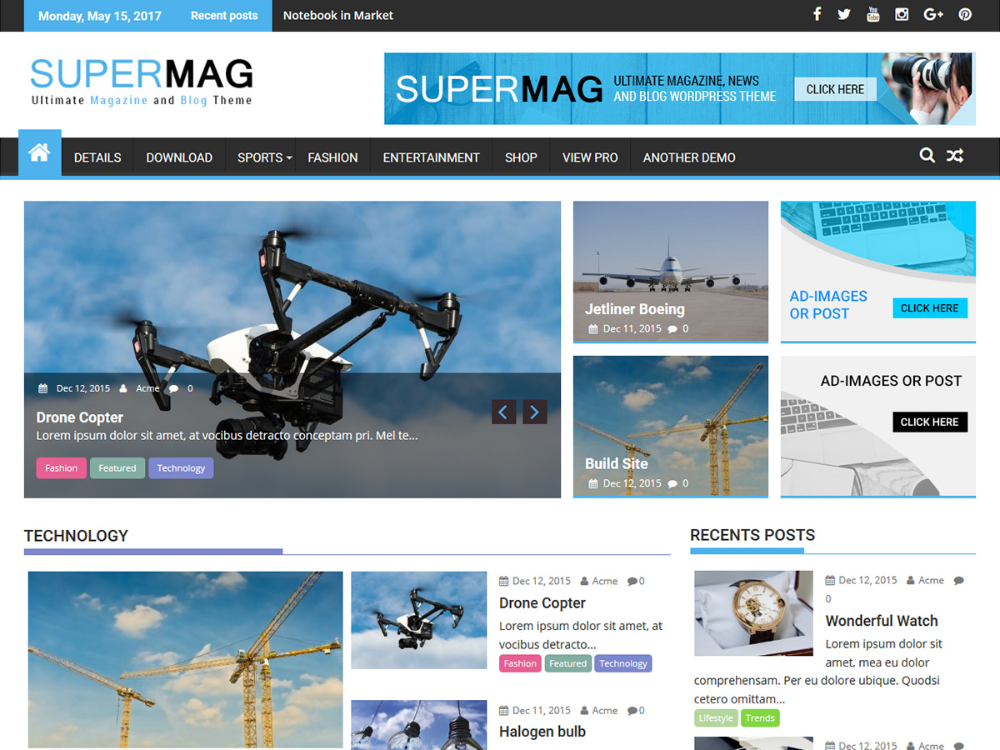

# SuperMag

**Contributors:** acmethemes  
**Requires at least:** 6.6  
**Tested up to:** 7.0  
**Requires PHP:** 7.4  
**Stable tag:** 4.0.0  
**License:** GPLv2 or later  
**License URI:** https://www.gnu.org/licenses/gpl-2.0.html  

> 

SuperMag is a feature-packed magazine theme built for news sites, online magazines, and content-rich blogs. With breaking news tickers, advertisement-ready layouts, drag-and-drop widget areas, and advanced customization options, it gives publishers and editors a powerful platform to engage readers.

## Features

- **Breaking news ticker** — scrolling headlines to keep readers informed
- **Advertisement ready** — add ads from the customizer or widgets
- **Drag-and-drop widget areas** — reorder homepage sections visually
- **Advanced custom widgets** — purpose-built for magazine layouts
- **Up to four-column layouts** — flexible grids for categories and posts
- **Custom colors** — one-click site-wide color change
- **Custom logo & menu** — full control over header branding
- **Footer widgets** — recent posts, categories, and social links
- **Featured image control** — enable/disable on blog, archive, and single pages
- **Breadcrumb navigation** — SEO-friendly structure
- **WooCommerce compatible** — sell subscriptions or merchandise
- **Page builder ready** — design with SiteOrigin and others
- **Editor-style support** — consistent editing experience
- **Translation ready** — .pot file included
- **RTL support** — right-to-left language compatible

## Installation

1. Download the theme zip file.
2. In your WordPress admin, go to **Appearance → Themes**.
3. Click **Add New** → **Upload Theme**.
4. Select the zip file and click **Install Now**.
5. Click **Activate**.

## Frequently Asked Questions

### How do I add the breaking news ticker?

Go to **Appearance → Customize → Breaking News Options** and select which categories to display.

### How do I arrange homepage sections?

SuperMag's widget areas are drag-and-drop enabled. Go to **Appearance → Widgets** and reorder them as needed.

## Credits

SuperMag is built on [Underscores](https://underscores.me/) and licensed under GPLv2 or later. It bundles the following third-party resources:

- [Google Fonts](https://fonts.google.com/) — Apache License 2.0
- [Font Awesome](https://fontawesome.com/) — MIT / SIL OFL 1.1
- [normalize.css](https://necolas.github.io/normalize.css/) — MIT
- [BxSlider](https://bxslider.com/) — MIT
- [SlickNav](https://github.com/ComputerWolf/SlickNav) — MIT
- [Theia Sticky Sidebar](https://github.com/WeCodePixels/theia-sticky-sidebar) — MIT
- [Breadcrumb Trail](https://github.com/justintadlock/breadcrumb-trail) — GPLv2+
- [TGM Plugin Activation](http://tgmpluginactivation.com/) — GPLv2+
- [html5shiv](https://github.com/afarkas/html5shiv) — MIT
- [Respond.js](https://github.com/scottjehl/Respond) — MIT

---

[Demo](http://www.acmethemes.com/demo/?theme=supermag) &middot; [Support](https://www.acmethemes.com/supports/) &middot; [Acme Themes](https://www.acmethemes.com)
